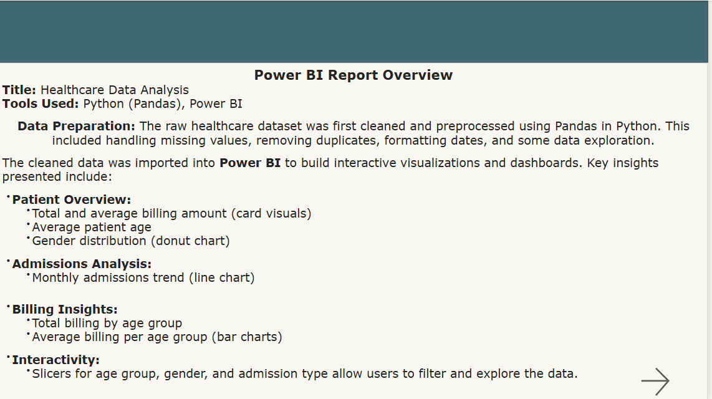
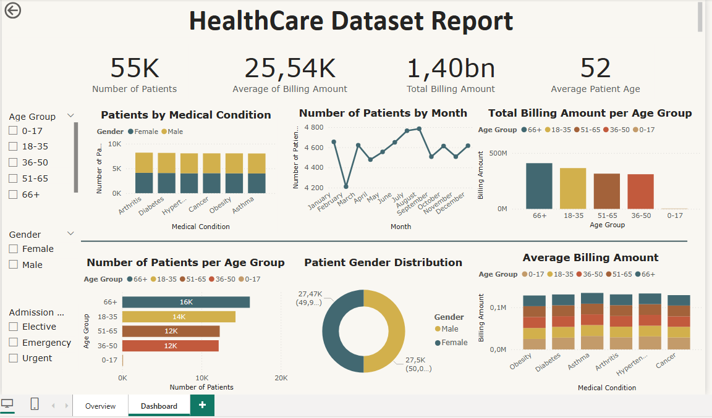

# Healthcare Analytics Project

## Project Overview
This project analyzes a healthcare dataset to uncover patient demographics and billing insights.  
The analysis was conducted in **Python (Google Colab)** for data cleaning and exploratory data analysis (EDA), **Excel** for power query cleaning, followed by **Power BI** for interactive dashboard creation.

---

## Tools & Skills Used
- Python (Pandas, Matplotlib, Seaborn) for cleaning and EDA
- Excel(Power Query) for advanced cleaning
- Power BI for visualization and dashboard design
- Data storytelling and KPI reporting

---

## Process
1. **Data Cleaning (Python) and Excel**
   - Handled missing values and duplicates.
   - Standardized column names and data formats.
   - Exported cleaned dataset as a new CSV and cleaned it using power query in Excel.

2. **Exploratory Data Analysis (EDA)**
   - Patient age distribution.
   - Gender-based comparisons.
   - Billing amount analysis.
   - Identified key trends and anomalies.

3. **Dashboard Creation (Power BI)**
   - KPIs and Charts:
     - Total Patients(card visual)
     - Average Age of Patients(card visual)
     - Monthly admissions trend(line chart)
     - Total Billing Amount(card visual)
     - Average Billing Amount(card visual)
     - Total billing by age group(bar chart)
     - Average billing per age group(bar)
   - Gender distribution(donut chart)
   - Interactive filters for better insights.

---

## Dashboard Preview

---

## How to Use
1. Open `/notebooks/cleaned_healthcare.ipynb` to view the data cleaning and EDA process in Python.  
2. Open `/powerbi/healthcare_visualization.pbix` in Power BI Desktop to interact with the dashboard.  
3. Sample cleaned dataset is available in `/data/cleaned_healthcare_excel`.

---

## Key Insights
- Gender distribution revealed [almost the same proportion of male and female patients, with males ahead by around 0.10%].  
- The average patient age was approximately [52 years].  
- Billing analysis showed [majority of revenue from patients of the 66+ age group].  

